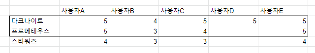
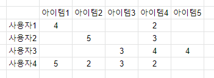

## 추천시스템의 유형

1. 콘텐츠 기반 필터링(Content based filtering)

2. 협업 필터링(Collaborative filtering)

   2.1 최근접 이웃(Nearest Neighbor) 협업 필터링

   ​	2.1.1 사용자 기반(User-User)

   ​	2.1.2 아이템 기반(Item-Item)

   2.2 잠재 요인(Latent Factor) 필터링
   
   ​	: 넷플릭스 추천 시스템 경진대회에서 행렬 분해(Matrix Factorization) 기법을 이용한 잠재 요인 협업 필터링 방식이 우승하면서 대부분 이 시스템을 적용 중.
   
   하지만, 아마존은 아직 최근접 이웃 방법을 사용하고 있고, 콘텐츠 기반과 협업 필터링 등을 적절히 결합해 사용하는 경우도 늘고 있음.

## 콘텐츠 기반 필터링 추천 시스템

1. 정의: 사용자가 특정한 아이템을 매우 선호하는 경우, 그 아이템과 비슷한 콘텐츠를 가진 다른 아이템을 추천하는 방식.

## 협업 필터링 - 최근접 이웃 협업 필터링(메모리 협업)

1. 정의: 쉽게 이야기하면, 나와 비슷한 친구에게 물어보는 것과 유사한 방식으로, 사용자가 아이템에 매긴 평점 정보나 상품 구매이력과 같은 사용자 행동 양식(User Behavior)만을 기반으로 추천을 수행하는 방식.

   사용자-아이템 평점 행렬을 사용하는데, 사용자가 아이템에 평점을 매기는 경우가 많지 않기 때문에 희소 행렬(Sparse Matrix, 값이 많이 비어 있는 행렬) 특성을 가지고 있습니다. 

2. 주요 목표: 사용자 - 아이템 평점 매트릭스와 같은 축적된 사용자 행동 데이터를 기반으로 사용자가 아직 평가하지 않은 아이템을 예측 평가(Predicted Rating)하는 것입니다. 협업 필터링은 사용자가 평가한 다른 아이템을 기반으로 사용자가 평가하지 않은 아이템의 예측 평가를 도출하는 방식입니다.

3. 최근접 이웃 협업 필터링 종류

   3.1 사용자 기반(User-User): 당신과 비슷한 고객들은 다음 상품도 구매했습니다!

   3.2 아이템 기반(Item-Item): 이 상품을 선택한 다른 고객들은 이 상품도 구매했습니다!

4. 사용자 기반(User-User) 방식

   : 특정 사용자와 유사한 다른 사용자를 TOP-N으로 선정해  TOP-N 사용자가 좋아하는 아이템을 추천하는 방식 입니다.

   

   A는 C보다 B와 가까움을 알 수 있습니다.

   그런데 B는 프로메테우스를, C는 스타워즈를 선호합니다. 따라서 프로메테우스를 추천해 주는 것입니다.

5. 아이템 기반(Item-Item) 방식

   : 명칭이 주는 이미지 때문에 '아이템 간의 속성'이 얼마나 비슷한지 기반으로 추천한다고 착각할 수 있습니다. 하지만!!!! 아이템 기반 방식은 아이템이 가지는 속성과 상관없이 사용자들이 그 아이템을 '좋아하는지 / 싫어하는지의 척도'가 유사한 아이템을 추천하는 기준이 되는 알고리즘입니다.

   

   위의 그림과 행과 열이 서로 반대임을 유의하세요!

   다크나이트에 대한 사람들의 선호와 비슷한 영화는 스타워즈보다는 프로메테우스 입니다. 따라서 이 영화를 안 본 사용자 D에 대해 프로메테우스를 추천해줍니다.

6. 사용자 기반과 아이템 기반 비교
   - 일반적으로 사용자 기반 보다는 아이템 기반 협업 필터링의 정확도가 더 높습니다.
   - 그 이유는 비슷한 영화를 좋아한다고 해서 사람들의 취향이 비슷하다고 판단하기는 어려운 경우가 많기 때문입니다.
   - 매우 유명한 영화는 취향과 관계없이 대부분의 사람이 관람하는 경우가 많고, 사용자들이 평점을 매긴 영화(또는 상품)의 개수가 많지 않은 경우가 일반적인데 이를 기반으로 다른 사람과의 유사도를 비교하기가 어려운 부분도 있습니다.
   - 따라서 최근접 이웃 협업 필터링은 대부분 아이템 기반의 알고리즘을 적용합니다.

## 잠재 요인 협업 필터링

사용자-아이템 평점 매트릭스에 숨어 있는 잠재 요인을 추출해 추천 예측을 하는 기법입니다. 대규모 다차원 행렬을 SVD와 같은 차원 감소 기법으로 분해하는 과정에서 잠재 요인을 추출하는데, 이러한 기법을 행렬 분해(Matrix Factorization)이라고 합니다.

잠재 요인 협업 필터링은 사용자-아이템 평점 행렬 데이터만을 이용해 말 그대로 '잠재 요인'을 끄집어 내는 것을 의미합니다. '잠재 요인'이 어떤 것인지는 명확히 정의할 수 없습니다. 하지만 이를 기반으로 

 1. 다차원 희소 행렬인 사용자-아이템 행렬 데이터를

    

    

 2. 저차원 밀집 행렬의 사용자-잠재요인 행렬과 아이템-잠재 요인 행렬의 전치 행렬(즉, 잠재요인 - 아이템 행렬)로 분해할 수 있으며,

    

    

 3. 이렇게 분해된 두 행렬의 내적을 통해 새로운 예측 사용자-아이템 평점 행렬 데이터를 만들어서 사용자가 아직 평점을 부여하지 않은 아이템에 대한 예측 평점을 생성하는 것이 이 알고리즘의 골자 입니다.

    

행렬 분해에 의해 추출 되는 '잠재 요인'이 정확히 어떤 것인지는 알 수 없지만, 가령 영화 평점 기반의 사용자-아이템 평점 행렬 데이터라면 영화가 가지는 장르별 특성 선호도로 가정할 수 있습니다. 즉, 사용자 - 잠재 요인 행렬은 사용자의 영화 장르에 대한 선호도로, 아이템-잠재 요인 행렬은 영화의 장르별 특성값으로 정의할 수 있습니다.

