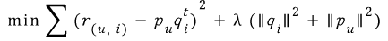

# 20191213(금) REPORT

## 확률적 경사 하강법을 이용한 행렬 분해

### 1. 확률적 경사 하강법(Stochastic Gradient Descent, SGD)

#### 1.1 경사 하강법 (Gradient Descent)

**GD (Gradient Descent):** GD는 가장 기본적은 뉴럴넷의 학습 방법으로, 전체 데이터에 대한 Error함수를 Weight로 미분하여 계산한 각 W 파라미터에 대한 gradient를 이용하여 Weight를 업데이트한다. 이 때 얼만큼의 gradient를 사용할지 결정하는 값을 learning rate라고 하는데, 이 값에 따라 local minima에 빠지거나 발산하는 경우가 있다. 또한 전체 데이터에 대한 계산을 한 뒤에 W를 업데이트하기 때문에, 계산량이 너무커 W가 optimal을 찾아가는 속도가 느려 현재는 거의 쓰이지 않고 있다. Batch Learning이라고도 부른다. 또한 gradient descent는 기울기가 양수(+)이면 w를 음수(-)방향으로 이동시켜야 하므로, 기울기의 반대 부호로 움직인다고 볼 수 있다.

W' = W − λ f'(W)   ( λ 는 learning rate이다.)

#### 1.2 확률적 경사 하강법(Stochastic Gradient Descent, SGD)

**SGD (Stochastic Gradeint Descent):** SGD는 위에서 GD가 갖는 너무 큰 계산량 문제를 해결하기 위해 전체 데이터중에서 랜덤하게 추출한 1/N의 데이터만을 사용해 훨씬 더 빠르게, 자주 업데이트하는 방법이다. 이 때 추출한 1/N의 데이터를 Minibatch라고 부르며, 이 데이터가 전체 데이터의 분포를 따라야만 제대로 된 학습이 가능하다. 만약 이 데이터가 전체 데이터의 분포를 따르지 않고, 계속 분포가 바뀌는 non-stationary한 경우를 online learning이라고도 부른다.

전체 데이터를 잘 섞어서, 너무 작지 않은 크기로 N 등분하면, 계산량이 1/N 배가되어, 빠르게 Weight를 업데이트할 수 있어, 이론상 N배 더 빠른 학습이 가능하다.

추후 SGD에서 각 Minibatch 분포가 매번 약간씩 달라지는 noise를 internal covariate shift라고 부르며, 이를 해결하기 위한 방법으로 batch-normalization이 등장한다.

### 2. 확률적 경사 하강법(SGD)을 이용한 행렬 분해

: P와 Q 행렬로 계산된 예측 R 행렬 값이 실제 R 행렬 값과 가장 최소의 오류를 가질 수 있도록 반복적인 비용 함수 최적화를 통해 P와 Q를 유추해 내는 것.

### 3. SGD를 이용한 행렬 분해의 절차

1) P와 Q를 임의의 값을 가진 행렬로 설정합니다.

2) P와 Q Transpose(전치)를 곱해 예측 T 행렬을 계산하고, 예측 R 행렬과 실제 R 행렬에 해당하는 오류 값을 계산합니다.

3) 위 오류 값을 최소화할 수 있도록 P와 Q 행렬을 적절한 값으로 각각 업데이트합니다.

4) 만족할 만한 오류 값을 가질 때까지 2, 3번 작업을 반복하면서 P, Q 값을 업데이트해 근사화합니다.

실제 값과 예측 값의 오류 최소화와 L2 규제(Regularization)을 고려한 비용 함수식은 다음과 같습니다.

일반적으로 사용자-아이템 평점 행렬의 경우 행렬 분해를 위해서 단순히 예측 오류값의 최소화와 학습 시 과적합을 피하기 위해서 규제를 반영한 비용 함수를 적용합니다. 그리고 위의 비용 함수를 최소화하기 위해서 새롭게 업데이트되는  $p^{'}_{u}$ 와 $q^{'}_{l}$ 은 다음과 같이 계산할 수 있습니다.

$$
p^{'}_{u} = p_{u} + \eta(e_{(u,i)} * q_{i} - \lambda*p_{u})
$$

$$
q^{'}_{i} = q_{i} + \eta(e_{(u,i)} * p_{u} - \lambda*q_{i})
$$

각 기호가 의미하는 바는 다음과 같습니다.

- $p_{u}$ : P 행렬의 사용자 u행 벡터
- $q^{t}_{i}$ : Q 행렬의 아이템 i 행의 전치 벡터 (transpose vector)
- $r_{(u, i)}$ : 실제 R 행렬의 u행, i열에 위치한 값
- $\hat{r}_{(u, i)}$ : 예측 $\hat{R}$ 행렬의 u행, i열에 위치한 값. $p_{u}$ * $q^{t}_{i}$ 로 계산
- $e_{(u, i)}$ : u행, i열에 위치한 실제 행렬 값과 예측 행렬 값의 차이 오류. $r_{(u, i)}$ - $\hat{r}_{(u, i)}$ 로 계산.
- $\eta$ : SGD 학습률
- $\lambda$ : L2 규제(Regularization) 계수

즉, L2 규제를 반영해 실제 R 행렬 값과 예측 R 행렬 값의 차이를 최소화하는 방향성을 가지고 P행렬과 Q 행렬에 업데이트 값을 반복적으로 수행하면서 최적화된 예측 R 행렬을 구하는 방식이 SGD 기반의 행렬 분해입니다.